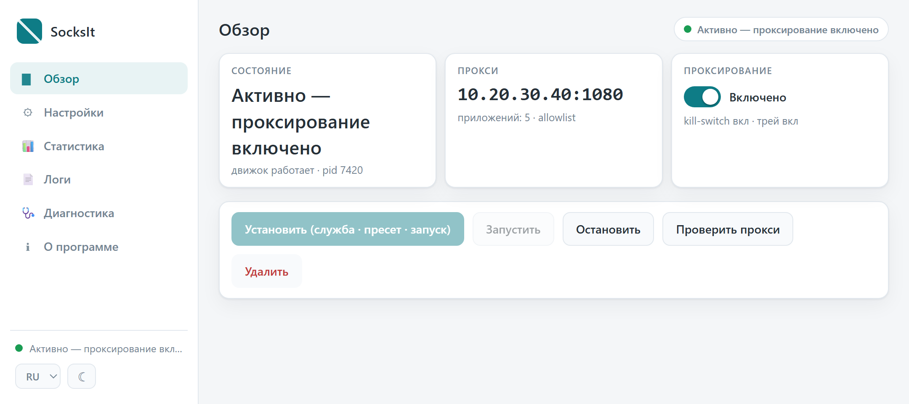
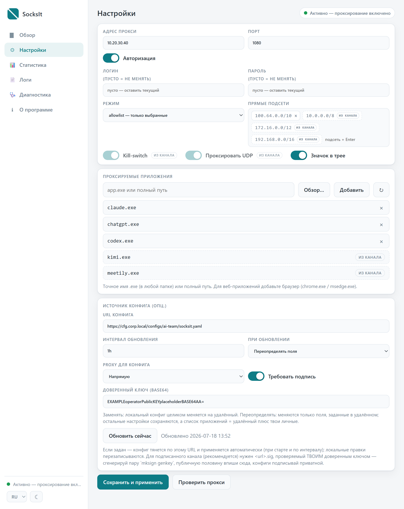
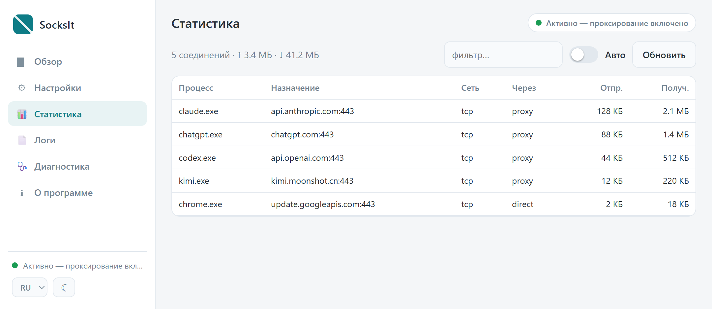
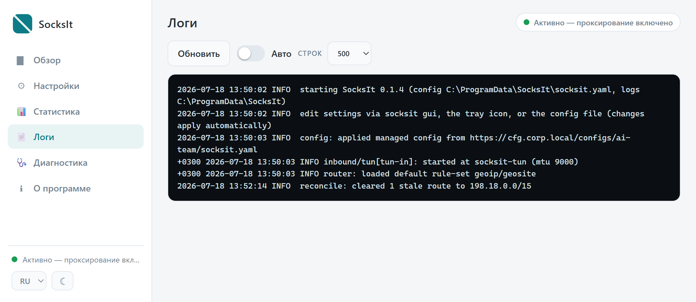
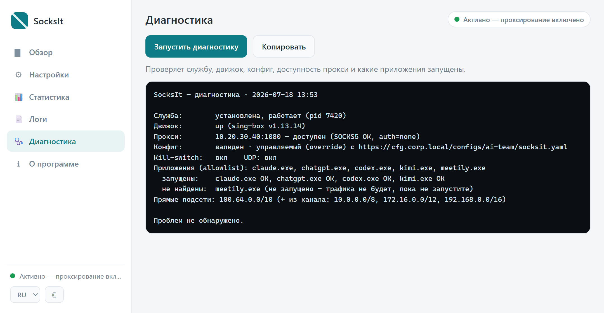
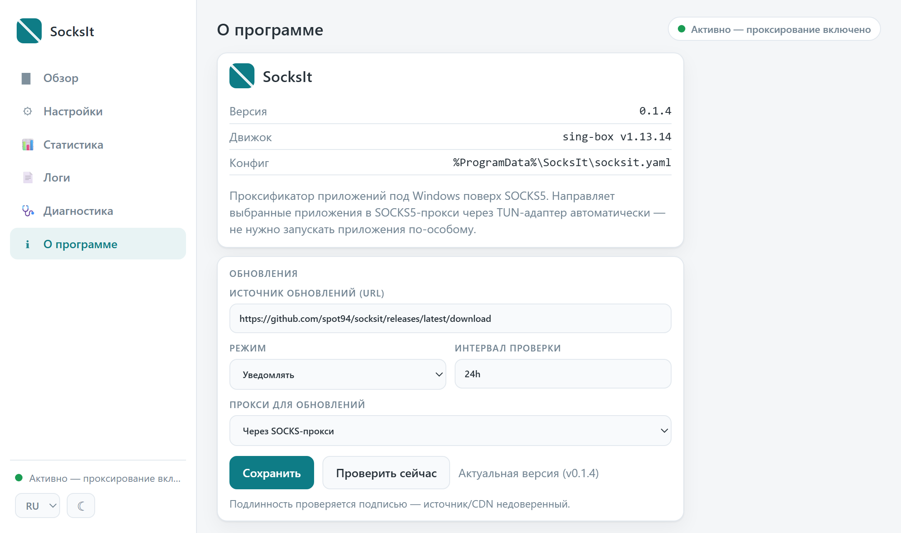

# SocksIt

Прозрачный проксификатор отдельных приложений под Windows 10/11 (x64): заворачивает
трафик выбранных программ в SOCKS5-прокси автоматически — приложения запускаются как
обычно, ничего не нужно стартовать через отдельный лаунчер.



## Что это и как работает

Служба (LocalSystem) поднимает виртуальный сетевой адаптер (TUN, Wintun) и запускает
движок **sing-box** как дочерний процесс. Приложения выбираются по имени или полному пути
процесса (например `chrome.exe`, `claude.exe`):

- их трафик перехватывается через TUN;
- DNS-запросы этих приложений подменяются на «fake-ip», чтобы соединения гарантированно
  шли через туннель;
- по правилам маршрутизации трафик выбранных приложений уходит в **SOCKS5-прокси**
  (TCP и UDP), остальной трафик идёт **напрямую**;
- при обрыве туннеля **kill-switch** не даёт проксируемым приложениям «утечь» напрямую.

Матчинг идёт и по имени, и по пути процесса, поэтому ловятся даже дочерние/песочные
процессы (например вкладки и служебные процессы Electron-приложений).

Управление — окно панели и значок в трее (работают в сессии пользователя) — общается со
службой по защищённому локальному каналу. Пароль к прокси хранится в зашифрованном виде
(DPAPI) и не пишется в конфиг.

Датаплейн — официальный **sing-box** (распространяется отдельным бинарём под GPLv3).

## Установка и запуск

Требуется: **Windows 10/11 x64**, права **администратора** для установки службы и
**Microsoft Edge WebView2 Runtime** (на Win10/11 обычно уже есть; иначе — поставить
«Evergreen WebView2 Runtime» от Microsoft).

1. Достаточно одного `socksit.exe`. Движок `sing-box.exe` можно положить рядом, но если его
   нет — он **скачается автоматически** при установке (из официального репозитория sing-box,
   с проверкой по контрольной сумме; при недоступности — из релизов SocksIt).
2. Запустите `socksit.exe` — откроется панель. Нажмите **Установить** (поставит службу, при
   необходимости скачает движок и запустит). Без прав администратора кнопки установки
   неактивны — перезапустите от имени администратора.
3. В разделе **Настройки** укажите адрес и порт SOCKS5-прокси (при необходимости логин/пароль)
   и добавьте приложения. Для веб-приложений (сайты в браузере) добавляйте **браузер**
   (`chrome.exe`, `msedge.exe`). Нажмите **Сохранить и применить**.
4. Убедитесь, что трафик реально идёт через прокси, в разделе **Статистика** (столбец
   **Через** = `proxy`).

Удаление — кнопка **Удалить** в панели или `socksit uninstall` от администратора.

## Пресет (преднастроенный конфиг)

Чтобы раскатать SocksIt на несколько машин без ручной настройки, параметры (прокси,
приложения, прямые подсети) можно задать **пресетом**. Тогда конечный пользователь один
раз жмёт **Установить** (или запускает `socksit setup` — тихо, годится для GPO/Intune):
пресет записывается в `%ProgramData%\SocksIt\socksit.yaml`, служба стартует — и всё уже
настроено.

Пресет — это обычный `socksit.yaml` (см. «Все настройки»); шаблон лежит в
`build/preset.example.yaml`. Задать его можно двумя способами (вшитый имеет приоритет над
файлом-соседом):

- **Файлом рядом с exe** — без пересборки: положите `socksit.preset.yaml` в одну папку с
  `socksit.exe`. При установке `setup` прочитает этот файл-сосед.
- **Вшитым в бинарь** — для одного самодостаточного exe: скопируйте
  `build/preset.example.yaml` в `internal/preset/preset.yaml`, отредактируйте и соберите с
  `go build -tags preset ./cmd/socksit`.

Если пресета нет — `setup` просто ставит и запускает службу с настройками по умолчанию,
дальше конфигурируете в панели. Повторный запуск `setup` **перезаписывает** конфиг
пресетом (держите пресет только на машинах для первичной раскатки).

Полное руководство по turnkey-сборкам (обе схемы, тихая установка, подпись бинаря) —
**[docs/building-installers.md](docs/building-installers.md)**.

## Панель управления (GUI)

Запуск: двойной клик по `socksit.exe` (или `socksit`). Единое окно, слева — меню разделов.
Внизу слева — переключатель **языка** (RU/EN) и **темы** (светлая/тёмная/системная).

**Обзор** — состояние службы и движка, адрес прокси и число приложений. Переключатель
**Проксирование** ставит проксирование на паузу / возобновляет без остановки службы. Кнопки
**Установить / Запустить / Остановить / Удалить** и **Проверить прокси**.

**Настройки** — адрес/порт прокси и переключатель **«Авторизация»** (открывает поля
логина/пароля; снятая галочка очищает сохранённые данные); режим **allowlist** (проксируются
только выбранные) или **blocklist** (все, кроме выбранных); **kill-switch**; **UDP**; **значок в
трее**; «прямые» подсети (в обход прокси, ввод чипами); список приложений (**Добавить**,
**Обзор…** — выбрать .exe из проводника, поле с автодополнением из запущенных процессов) и
блок **Источник конфига** (управляемый конфиг с сервера — см. ниже).



**Статистика** — активные соединения: **Процесс · Назначение · Сеть · Через · Отпр. ·
Получ.** Клик по заголовку сортирует, есть фильтр и авто-обновление. `Через = proxy`
означает, что соединение реально проксируется.



**Логи** — журнал службы и движка; выбор числа строк и авто-обновление. Строки службы —
в едином формате `дата время УРОВЕНЬ сообщение`, строки движка — в формате sing-box;
ANSI-цвет снимается, чтение идёт с конца файла.



**Диагностика** — отчёт «почему приложение не проксируется»: проверяет службу, движок,
конфиг, доступность прокси и какие из настроенных приложений сейчас запущены.



**О программе** — версия, версия движка, путь к конфигу и блок **Обновления** (источник,
режим off/notify/auto, интервал, прокси для проверок, «Проверить сейчас» и «Установить
обновление»). Скачивание идёт с проверкой подписи и перезапуском службы с откатом при
неудаче. В режиме **notify** при обнаружении новой версии в трее всплывает уведомление
(клик → панель); в режиме **auto** обновление скачивается и устанавливается само.



**Трей** (значок в области уведомлений): строка статуса, чекбокс **Проксирование**
(пауза/возобновление), **Открыть SocksIt** и версия. Значок присутствует, пока служба
установлена (и включён параметр «Значок в трее»); отдельного пункта «Выход» нет.

## Управляемый конфиг с сервера

SocksIt умеет тянуть конфиг маршрутизации из **центрального сервера** и применять его
автоматически — удобно для команды или парка машин: раздал клиентам `config_source.url`
(и доверенный ключ) один раз, дальше правила (адрес прокси, список приложений, подсети,
kill-switch/UDP) обновляются централизованно.

- Клиент при старте и по интервалу тянет `socksit.yaml` с URL, проверяет **подпись**
  доверенным ключом (Ed25519) и применяет.
- **Режимы слияния:** *replace* — локальный конфиг заменяется удалённым целиком; *override* —
  из удалённого берутся только заданные поля, а списки приложений и подсетей **объединяются**
  с личными (пришедшие из канала показаны отдельной строкой «из канала»).
- Сервер может **форсить** отдельные тумблеры (kill-switch/UDP) — на клиенте они блокируются.
- **Ключ — оператора, а не автора приложения.** У каждого развёртывания свой ключ: генерируешь
  пару, публичную половину раздаёшь клиентам (`config_source.pubkey`), приватной подписываешь
  конфиги. Для доверенной сети подпись можно отключить.
- Переезд сервера / смена ключа — через подписанный сайдкар миграции: смену URL клиент
  применяет автоматически, смену доверенного ключа — только с подтверждением в панели.
- **Отвязка:** очистишь `config_source.url` — клиент вернётся к локальному конфигу, выбросит
  приложения и подсети из канала и разблокирует форсированные тумблеры.

Серверная часть — **отдельный компонент**: Docker-сервис с веб-панелью (профили каналов,
генерация/импорт ключа подписи, аудит-лог, роли **Администратор/Оператор** через LDAP/AD).
Полное руководство — установка, деплой, first-run и работа с интерфейсом:

➡ **[docs/configserver.md](docs/configserver.md)**

## Все настройки (`socksit.yaml`)

Конфиг лежит в `%ProgramData%\SocksIt\socksit.yaml`; правки в файле применяются автоматически
(служба следит за файлом). Обычно всё редактируется в панели — таблица ниже для справки и для
headless-сценариев.

### `proxy` — вышестоящий SOCKS5

| Поле | Значение | По умолч. | Описание |
|---|---|---|---|
| `address` | IP/хост | — (**обязательно**) | адрес SOCKS5-прокси |
| `port` | 1–65535 | `1080` | порт прокси |
| `username` / `password` | строка | — | логин/пароль. **В YAML не хранятся** — задаются панелью и шифруются службой (DPAPI) |
| `udp` | `true`/`false` | `true` | UDP ASSOCIATE (если сервер не умеет UDP — путь для UDP просто отсутствует) |
| `interface` | имя адаптера | — (авто) | локальный интерфейс для дозвона до SOCKS-сервера. Пусто = определяется автоматически по маршруту до прокси. Задавайте вручную (напр. `Ethernet 2`), только если авто-определение промахивается |

> **Прокси за корпоративным VPN (напр. Cisco AnyConnect, split-tunnel).** Если SOCKS-сервер
> достижим только через VPN, служба (LocalSystem) по умолчанию бьётся в физический интерфейс и
> получает таймаут. SocksIt автоматически определяет адаптер, через который идёт маршрут до
> прокси, и привязывает к нему дозвон. Поднимайте VPN **до** запуска/применения настроек;
> после переподключения VPN — перепримен/перезапустите службу, чтобы адаптер определился заново.

### Маршрутизация

| Поле | Значение | По умолч. | Описание |
|---|---|---|---|
| `apps` | список | `[]` | процессы для проксирования: имя (`chrome.exe`) или полный путь |
| `mode` | `allowlist` / `blocklist` | `allowlist` | `allowlist` — проксируются только из списка; `blocklist` — все, кроме списка |
| `direct_subnets` | список CIDR | `127.0.0.1/32`, `10.0.0.0/8`, `172.16.0.0/12`, `192.168.0.0/16` | подсети назначения, которые всегда идут **напрямую** мимо прокси (loopback + RFC 1918) |
| `kill_switch` | `true`/`false` | `true` | при обрыве туннеля резать проксируемые приложения (не давать «утечь» напрямую) |

### Интерфейс и диагностика

| Поле | Значение | По умолч. | Описание |
|---|---|---|---|
| `show_tray` | `true`/`false` | `true` | держать значок в трее, пока служба установлена |
| `log.level` | `error`/`warn`/`info`/`debug`/`trace` | `warn` | подробность логов службы и движка (сохраняется при обновлении управляемого конфига) |
| `dns.fakeip_v4` | CIDR | `198.18.0.0/15` | диапазон fake-ip (менять не нужно) |
| `control.clash_api` | `host:port` (loopback) | `127.0.0.1:9797` | адрес Clash API движка для статистики |

### `update` — обновления приложения

| Поле | Значение | По умолч. | Описание |
|---|---|---|---|
| `endpoint` | URL | релизы на GitHub | канал релизов; пусто = обновления выключены |
| `channel` | строка | `stable` | имя канала (какой manifest тянуть) |
| `mode` | `off`/`notify`/`auto` | `notify` | `off` — не проверять; `notify` — уведомить в трее при обнаружении; `auto` — скачать и установить автоматически (подпись + откат) |
| `check_interval` | длительность (≥ `1h`) | `24h` | как часто проверять |
| `proxy` | `""`/`system`/`use-socks`/`socks5://…`/`http://…` | `use-socks` | как ходить за обновлениями. Бинарь проверяется подписью, поэтому источник недоверенный |

### `config_source` — управляемый конфиг с сервера

| Поле | Значение | По умолч. | Описание |
|---|---|---|---|
| `url` | URL | пусто | фид конфига; пусто = локальный конфиг |
| `interval` | длительность (≥ `1m`) | `1h` | период обновления (плюс на старте) |
| `signed` | `true`/`false` | `true` | требовать подпись `<url>.sig` |
| `merge` | `replace`/`override` | `override` | как применять: заменить целиком или наложить поля + объединить списки |
| `pubkey` | base64 Ed25519 | — | доверенный ключ проверки подписи (ключ **оператора**) |
| `proxy` | `""`/`system`/`use-socks`/`socks5://…` | `""` (напрямую) | как достаётся сам фид. По умолчанию напрямую: фид не должен идти через тот же прокси, который настраивает |

> Поля `managed_apps`, `managed_subnets`, `pending_pubkey`, `declined_pubkey`, `locked` —
> служебные, их поддерживает служба; вручную не редактируйте.

Минимальный пример:

```yaml
proxy:
  address: 10.0.0.1
  port: 1080
apps:
  - chrome.exe
  - claude.exe
mode: allowlist        # allowlist | blocklist
kill_switch: true
```

## Командная строка (CLI)

Полное дерево команд — `socksit help`; флаги команды — `socksit help <команда>`.
Многие команды работают с запущенной службой по локальному каналу и требуют её наличия.

**Общее**

| Команда | Что делает |
|---|---|
| `socksit` | Открыть панель управления (без аргументов). |
| `socksit version [--json]` | Версия приложения и движка. |
| `socksit help [команда]` | Справка (общая или по команде). |

**Служба** (установка/удаление — от администратора)

| Команда | Что делает |
|---|---|
| `socksit install` \| `uninstall` | Зарегистрировать / удалить службу Windows. |
| `socksit start` \| `stop` \| `restart` | Запустить / остановить / перезапустить службу. |
| `socksit status [--json]` | Состояние службы (SCM) + туннеля. |
| `socksit setup` | Turnkey: установить + применить пресет + запустить. |

**Конфиг**

| Команда | Что делает |
|---|---|
| `socksit config show [--json] [--effective]` | Показать текущий конфиг (пароль скрыт; `--effective` — с учётом канала). |
| `socksit config validate [-c f.yaml] [-engine ...]` | Проверить конфиг через `sing-box check`. |
| `socksit config gen [-c f.yaml] [-o config.json]` | Сгенерировать конфиг движка. |
| `socksit config apply -c f.yaml` | Загрузить конфиг из файла в службу (с валидацией). |
| `socksit config log-level [error\|warn\|info\|debug\|trace]` | Показать (без аргумента) или сменить уровень логов. |
| `socksit config app add\|rm <exe…>` · `app list [--json]` | Добавить / убрать / показать проксируемые приложения. |
| `socksit config subnet add\|rm <cidr…>` · `subnet list` | Добавить / убрать / показать прямые подсети. |

**Диагностика**

| Команда | Что делает |
|---|---|
| `socksit doctor [--json]` | Сводка окружения: служба, движок, конфиг, доступность канала, версии. |
| `socksit proxytest [--json] [-c f.yaml]` | Проверить вышестоящий SOCKS5 (доступность + рукопожатие). |
| `socksit logs [-n N] [-f] [--audit]` | Хвост лога службы (или `--audit`), с `-f` — следить. |

**Прочее**

| Команда | Что делает |
|---|---|
| `socksit gui` | Открыть панель сразу на разделе «Настройки». |
| `socksit tray` | Значок в трее. |

`config check` — псевдоним `config validate`; старые `socksit gen` / `socksit check` остаются
как совместимые псевдонимы. Служебные команды `service` (запуск под Windows SCM) и
`update-restart` (хелпер обновления) вызываются автоматически и в справке скрыты.

## Файлы и данные

Всё в `%ProgramData%\SocksIt\`:

| Файл | Назначение |
|---|---|
| `socksit.yaml` | конфигурация (см. раздел «Все настройки») |
| `socksit.log` | лог службы + движка (ротация по размеру) |
| `audit.log` | аудит действий администратора |
| `creds.dpapi` | логин/пароль прокси в зашифрованном виде (DPAPI) |

## Лицензия

Код SocksIt — под лицензией **MIT** (файл `LICENSE`). Движок **sing-box** распространяется
отдельным неизменённым бинарём под собственной лицензией **GPLv3**.
