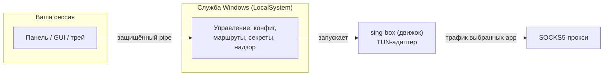
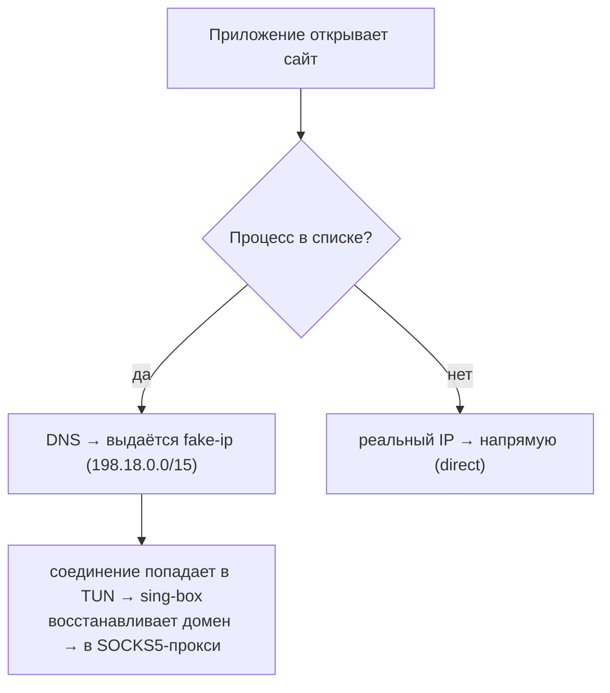

# SocksIt — справка

Локальный Windows-сервис (Win10/11 x64), который **прозрачно и автоматически** заворачивает
трафик выбранных приложений в SOCKS5-прокси. Надёжнее ProxiFyre (без «отвалов» перехвата) и
автоматичнее SocksCap64 (приложения запускаются как обычно, ничего не нужно стартовать «изнутри»).

---

## 1. Как это устроено



Три части:
- **Служба** (`LocalSystem`) — вся привилегированная работа: создаёт виртуальный сетевой адаптер,
  правит маршруты, хранит секреты, следит за движком.
- **Движок** — встроенный [sing-box](https://sing-box.sagernet.org/): собственно перенаправляет
  трафик; управляется конфигом, который служба генерирует из ваших настроек.
- **Панель / GUI / трей** — интерфейс пользователя; отдельное приложение вашей сессии, общается со
  службой по локальному именованному каналу.

**Почему не одна программа?** Адаптер Wintun в Windows открывается только из-под системной учётки,
а служба по правилам ОС (изоляция Session 0) не может показывать окна. Отсюда разделение:
привилегированная часть — служба, интерфейс — отдельный процесс.

---

## 2. Как перехватывается трафик (главный принцип)

SocksIt поднимает **виртуальный адаптер (TUN)**, захватывает весь трафик и применяет приём
**fake-ip** + маршрутизацию **по процессу**:



Словами:
1. Приложение из списка резолвит домен — SocksIt отдаёт ему «поддельный» IP.
2. Соединение к fake-ip уходит в движок, тот вспоминает домен и открывает его через прокси.
3. Приложения **вне** списка получают реальный IP и идут напрямую.

Отбор — по **имени процесса** (`chrome.exe`) или **полному пути** (`C:\Games\game.exe`).
Имя должно быть **точным, с `.exe`**. Для веб-сервисов, открываемых в браузере (например claude.ai),
указывайте **браузер** (`chrome.exe`/`msedge.exe`) — маршрутизация по процессу, не по сайту.

**Только IPv4.** У TUN нет IPv6-адреса: v6 через туннель не заворачивается и обрабатывается ОС
нативно. Это осознанно — иначе dual-stack сайты (yandex, google) рвались бы при попытке v6 через
туннель.

---

## 3. Режимы и поведение

- **`mode`** — `allowlist` (по умолчанию): в прокси только перечисленные приложения; `blocklist`:
  всё, кроме перечисленных.
- **`kill_switch`** — `true` (по умолчанию): пока туннель не поднят, проксируемые приложения не
  выпускаются в сеть (защита от утечки реального IP; непроксируемый трафик не затронут).
  `false` (fail-open): при обрыве идут напрямую.
- **`direct_subnets`** — подсети назначения, которые всегда идут напрямую (в обход прокси), даже для
  проксируемых приложений (напр. LAN `192.168.1.0/24`). Приватные диапазоны и так идут напрямую.

Режим захвата один — **полный** (перехват всего трафика + маршрутизация по процессу). Единственное
следствие: SocksIt **не уживается с полнотуннельным VPN** (оба претендуют на маршрут по умолчанию) —
это архитектурно неизбежно, т.к. fake-ip требует перехвата DNS.

---

## 4. DNS

- Пока служба работает, движок — **промежуточный DNS-резолвер** для захваченного трафика (это нужно
  для fake-ip).
- Апстрим — **системный DNS** (те серверы, что настроены у вас от роутера/DHCP). Публичные адреса
  (8.8.8.8 и т.п.) в конфиг не зашиты.
- Домены **проксируемых** приложений резолвятся на стороне прокси (через fake-ip) — чтобы их DNS тоже
  шёл через прокси и не «утекал». Непроксируемые — через ваш системный DNS.

---

## 5. Надёжность и восстановление

- **Надзор за движком** через Windows Job Object: если служба падает, движок гарантированно
  завершается вместе с ней (никаких «зависших» процессов). При краше движка служба перезапускает его
  сама, с нарастающей паузой.
- **Смена сети** (Wi-Fi↔Ethernet, VPN up/down) обрабатывается самим sing-box (`auto_detect_interface`).
- **Чистое завершение**: при остановке маршруты/адаптер снимаются; после жёсткого килла осиротевший
  адаптер вычищается на следующем старте — интернет системы не «пропадает».

---

## 6. Безопасность

- **Секреты** (логин/пароль SOCKS5) шифруются DPAPI, расшифровываются только SYSTEM на этой машине,
  в открытый конфиг и в git не попадают. GUI передаёт пароль службе по защищённому каналу.
- **Канал управления** (named pipe) защищён списком доступа (SDDL): только SYSTEM, администраторы и
  текущий пользователь; всем остальным — запрещено (deny-by-default, проверяется ядром).
- **Аудит**: действия пользователя (правка конфига, вкл/выкл, перезапуск) пишутся человекочитаемо —
  `кто → что → над чем`; пароли в лог не попадают.
- **Данные и модели**: SocksIt — сетевое ПО и **не передаёт никакие данные в ИИ-модели**.

---

## 7. Установка и первый запуск

SocksIt — **гибридный exe**: без аргументов открывается панель управления, с аргументами работает
как CLI.

Самый простой путь — **панель** (двойной клик по `socksit.exe`) → **Set up** (от администратора):
установит службу в стабильную папку, применит преднастройки (если есть) и запустит. Либо по шагам:
Install → Start.

Из командной строки (от администратора):
```powershell
.\socksit.exe install     # копирует exe+движок в C:\Program Files\SocksIt и регистрирует службу
Start-Service SocksIt
```
При первом старте служба создаёт `C:\ProgramData\SocksIt\socksit.yaml` (пустой список — пока ничего
не проксируется). Настраивайте через окно настроек или файл; изменения применяются **на лету**.

Подробнее: [install.md](install.md); быстрая проверка — [testing-now.md](testing-now.md).

---

## 8. Настройка — `socksit.yaml`

```yaml
proxy:
  address: 10.0.0.1     # адрес SOCKS5-сервера (IP или хост)
  port: 1080
  username: ""          # пусто = без авторизации
  password: ""
  udp: true             # проксировать UDP (если сервер умеет; иначе — только TCP)
apps:                   # какие приложения проксировать (точные имена .exe или полные пути)
  - chrome.exe
  - C:\Games\game.exe
direct_subnets:         # подсети, всегда напрямую (в обход прокси)
  - 192.168.1.0/24
mode: allowlist         # allowlist | blocklist
kill_switch: true       # true | false (fail-open)
show_tray: true         # true | false — значок в трее, пока служба установлена
dns:
  fakeip_v4: 198.18.0.0/15   # диапазон «поддельных» адресов (обычно менять не нужно)
control:
  clash_api: 127.0.0.1:9797  # локальный порт статистики (только loopback)
```

| Поле | Значение |
|---|---|
| `proxy.address/port` | Куда отправлять трафик (ваш SOCKS5). |
| `proxy.username/password` | Авторизация; в бою хранится зашифрованно, не в этом файле. |
| `proxy.udp` | Разрешить UDP через прокси. |
| `apps` | Список приложений: точное имя процесса (с `.exe`) или полный путь. |
| `direct_subnets` | Произвольные подсети, всегда идущие напрямую (даже для проксируемых app). |
| `mode` | `allowlist` — только эти; `blocklist` — все кроме этих. |
| `kill_switch` | `true` — блокировать при обрыве; `false` — пускать напрямую. |
| `show_tray` | `true` (по умолч.) — держать значок в трее, пока служба установлена; `false` — трей не запускается, запущенный закрывается. |
| `dns.fakeip_v4` | Диапазон fake-ip. По умолчанию корректен. |
| `control.clash_api` | Порт статистики (loopback). |
| `update.endpoint` | База релизов (GitHub `…/releases/latest/download`); пусто = обновления выкл. |
| `update.channel` | `stable` \| `beta`. |
| `update.mode` | `off` \| `notify` \| `auto`. |
| `update.check_interval` | Период автопроверки (мин. 1h). |
| `update.proxy` | Как ходить на endpoint: `""` напрямую \| `system` \| `use-socks` \| `socks5://…` \| `http://…`. |

Проще задавать всё в окне настроек — файл трогать не обязательно.

---

## 9. Управление

### Панель управления — единое окно (запуск `socksit.exe` без аргументов)
Панель — **одно окно** на WebView2 (Edge WebView2 Runtime; на Win10/11 есть по умолчанию) с
**белой/тёмной темой** (переключатель ◐ внизу слева; выбор запоминается), **выбором языка**
(EN/RU, селектор внизу слева; по умолчанию — по языку системы) и меню-сайдбаром слева.
Никаких дополнительных окон, диалогов и всплывашек — всё внутри панели. Окно единственное: повторный
запуск просто выводит его на передний план. Разделы:

- **Dashboard** (по умолчанию) — карточки состояния (служба/движок/PID, прокси, приложения, kill-switch,
  трей), большой переключатель **Proxying** (пауза/возобновление), кнопки **Set up / Start / Stop /
  Uninstall** (активны по реальному состоянию) и **Test proxy**. Без прав администратора действия со
  службой неактивны — показывается «Restart as administrator» (UAC).
- **Settings** — прокси (адрес, порт, логин/пароль — пароль шифрует служба, пустые поля = не менять),
  режим, kill-switch, UDP, «Show in tray», bypass-подсети, список приложений (добавление с
  автодополнением из запущенных процессов). **Save & apply** — на лету; при остановленной службе
  сохраняется в файл и применяется на старте. Результат показывается строкой-баннером, без окон.
- **Statistics** — таблица активных соединений: **Process · Destination · Net · Via · Up · Down** (`Via =
  proxy` = реально проксируется), фильтр и авто-обновление; сверху итоги (↑/↓).
- **Logs** — просмотр `socksit.log` прямо в окне (выбор числа строк, авто-обновление).
- **Diagnostics** — отчёт «почему не проксируется» (служба/движок/конфиг/достижимость прокси/какие
  приложения запущены), с кнопкой Copy.
- **About** — версия, версия движка, путь к конфигу, и блок **Updates**: источник (GitHub-релизы),
  канал, режим (off/notify/auto), интервал, прокси для проверок, кнопка «Проверить сейчас» и статус.
  Обновления проверяются по **подписанному манифесту** (подробнее — [docs/update-design.md](update-design.md)).

### Трей (`socksit tray`)
Минимальное меню (сверху вниз):
- **SocksIt — `<статус>`** — живая строка состояния (`active ✓` / `paused` / `⚠ tunnel … — apps blocked` /
  `service stopped`), обновляется каждые 2 с; полный статус с адресом прокси — в подсказке при наведении.
- **☑ Proxying enabled** — чекбокс: клик ставит на паузу / возобновляет (недоступен, если служба остановлена).
- **Open SocksIt** — открыть единое окно панели (там всё остальное: настройки, статистика, логи, диагностика).
- **SocksIt vX.Y.Z** — версия (неактивно).

Пункта «Quit» нет намеренно — трей закрывается сам при удалении службы или снятии галки «Show in tray».

**Жизненный цикл привязан к службе и переключателю «Show in tray».** Пока служба
установлена **и** включён параметр `show_tray` (галка «Tray icon» в настройках),
работающая служба держит в активной сессии ровно один экземпляр трея и
перезапускает его в течение нескольких секунд, если он пропал (падение, снятие
через диспетчер задач, свежий вход в систему). Значок исчезает сам (в течение
~2 с), если: службу **удалили** (Uninstall) — или сняли галку «Show in tray».
Поэтому у трея нет пункта «Quit»: единственные способы убрать значок — отключить
`show_tray` или удалить службу. Дубликат запустить нельзя: второй экземпляр сразу
завершается (глобальный мьютекс). Технически: служба (LocalSystem) запускает трей
в пользовательской сессии через `WTSQueryUserToken` + `CreateProcessAsUser`.

### CLI (`socksit <команда>`)
| Команда | Что делает |
|---|---|
| (без аргументов) | Открыть панель управления |
| `version` | Версия |
| `setup` | Turnkey: установить + применить preset + запустить (админ) |
| `install` / `uninstall` | Регистрация/удаление службы (админ) |
| `service` | Запуск под управлением Windows |
| `run` | Интерактивный запуск для разработки |
| `gen -c socksit.yaml [-o config.json]` | Показать/сохранить конфиг движка |
| `check -c socksit.yaml` | Проверить конфиг (`sing-box check`) |
| `tray` | Значок в трее |
| `gui` | Окно настроек |

CLI-вывод виден в терминале; двойной клик открывает панель (без вспышки консоли).

---

## 10. Файлы и папки

| Где | Что |
|---|---|
| `C:\Program Files\SocksIt\` | `socksit.exe` + движок (`sing-box.exe`, `libcronet.dll`) — неизменяемые бинарники |
| `C:\ProgramData\SocksIt\socksit.yaml` | ваши настройки |
| `C:\ProgramData\SocksIt\config.json` | сгенерированный конфиг движка (что реально применено) |
| `C:\ProgramData\SocksIt\creds.dpapi` | зашифрованные креды SOCKS5 |
| `C:\ProgramData\SocksIt\socksit.log` | лог службы и движка |
| `C:\ProgramData\SocksIt\audit.log` | лог действий пользователя |

Бинарники и данные разнесены намеренно: Program Files доступен пользователю только на чтение
(данные туда писать нельзя), а конфиг должен редактироваться без прав администратора.

---

## 11. Диагностика

| Симптом | Куда смотреть |
|---|---|
| Конфиг не принимается | `socksit.exe check -c socksit.yaml` — сообщение объяснит ошибку |
| Служба не стартует / нет проксирования | `Get-Service SocksIt`; лог `C:\ProgramData\SocksIt\socksit.log` |
| Движок жив? | `Test-NetConnection 127.0.0.1 -Port 9797 -InformationLevel Quiet` (True = ок) |
| Приложение не проксируется | имя процесса точное (с `.exe`)? есть в `apps`? служба запущена? для веб-приложений добавлен браузер? |
| Что реально применено | `C:\ProgramData\SocksIt\config.json` |
| Кто что менял | `C:\ProgramData\SocksIt\audit.log` |
| Что куда идёт | панель → **Statistics** (колонка `Via`) |
| Антивирус удалил exe | ложное срабатывание эвристики на неподписанный сетевой сервис — добавьте в исключения `C:\Program Files\SocksIt\` и подпишите (см. ниже) |

---

## 12. Дистрибутивы «под ключ» и подпись

- **Установочные сборки с преднастройками** (пользователю ничего настраивать не нужно) — единый
  self-contained exe или комплект exe + `socksit.preset.yaml`. См. [building-installers.md](building-installers.md).
- **Подпись кода** (снимает вердикты антивируса/SmartScreen) — self-signed + доверие через GPO для
  внутренней раздачи, либо Azure Trusted Signing / OV-сертификат для публичной. См.
  [signing.md](signing.md) и скрипт `build/sign.ps1`.

---

## 13. Границы

**Вне назначения:** собственный драйвер ядра (используется подписанный Microsoft Wintun),
кросс-платформенность (только Windows), сам SOCKS5-сервер (его предоставляете вы),
многопользовательский/удалённый режим.

**Ограничения:**
- Не уживается с полнотуннельным VPN (см. §3).
- Установка службы и per-app перехват требуют **прав администратора**.
- UDP работает, только если это умеет ваш SOCKS5-сервер.
- IPv6 через туннель не проксируется (идёт нативно).

---

## 14. Словарь

- **TUN-адаптер** — виртуальная сетевая карта; попавший в неё трафик обрабатывает SocksIt.
- **fake-ip** — временный «поддельный» IP, выдаваемый проксируемому приложению, чтобы направить его
  соединение в туннель; реальный домен восстанавливается движком и резолвится на прокси.
- **allowlist / blocklist** — «проксировать только этих» / «проксировать всех кроме этих».
- **kill-switch** — блокировка проксируемого трафика при обрыве туннеля (без утечки реального IP).
- **preset** — преднастроенный конфиг, вшитый в установочную сборку или лежащий рядом с exe.
- **LocalSystem** — системная учётная запись Windows, под которой работает служба.
