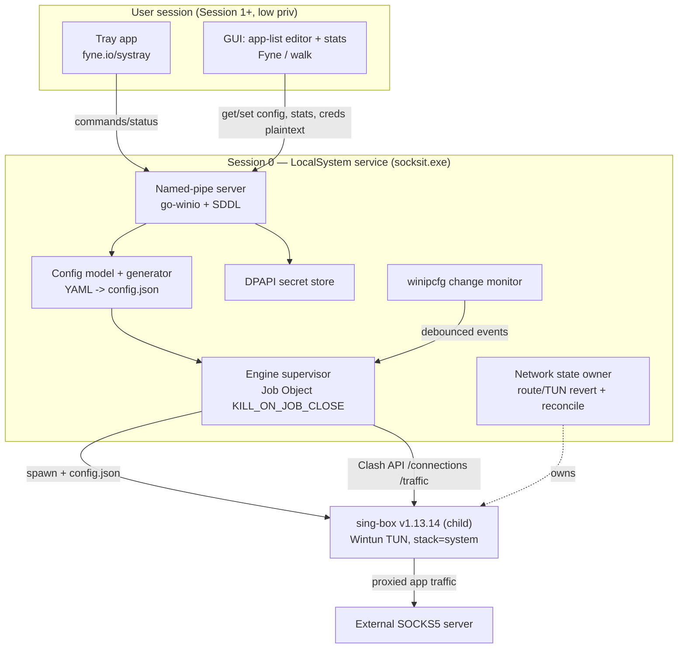
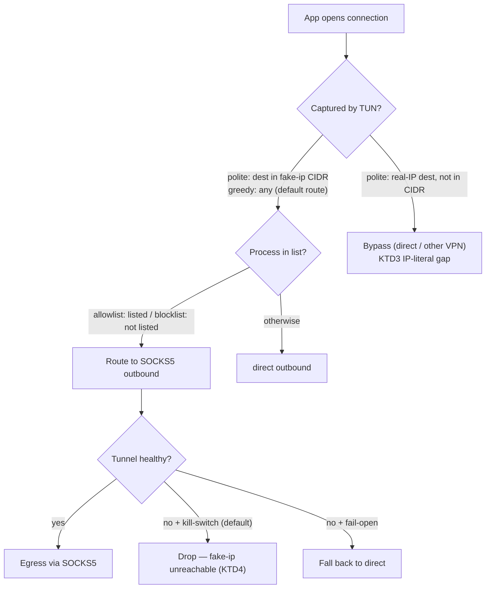
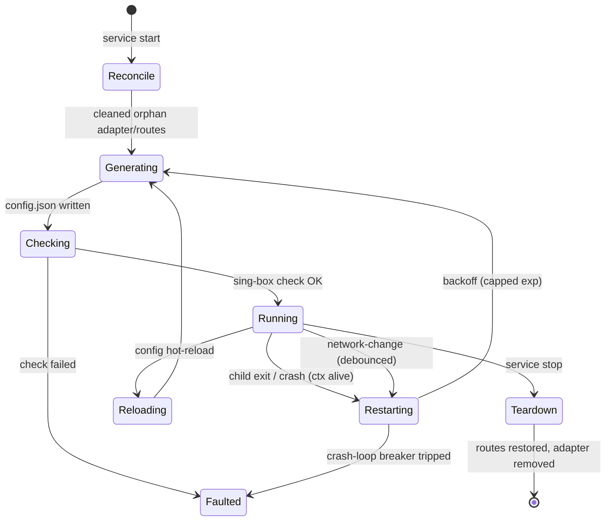

# SocksIt — Plan

> **Product Contract preservation.** Product Contract (Goal Capsule, Problem Frame, Actors,
> Requirements, Flows, Acceptance Examples, Scope, Corporate Floor) is **unchanged** — all
> R/A/F/AE IDs preserved. One HOW-level correction: the **gVisor** TUN stack assumption from
> our brainstorm discussion is superseded by [KTD2](#ktd2--tun-stack--system-not-gvisor) (`system`/`mixed`
> stack) — gVisor breaks per-app process matching on Windows. Product scope is not affected.

---

## Goal Capsule

**Objective.** Локальный однопользовательский Windows-сервис (Win10/11 x64), который
**прозрачно** заворачивает трафик выбранных приложений в SOCKS5-прокси (TCP+UDP+DNS)
по имени/пути процесса — **без** ручного добавления и запуска приложений через какой-либо
GUI. Надёжнее ProxiFyre (нет «отвалов» перехвата) и автоматичнее SocksCap64 (приложения
стартуют как обычно).

**Product authority.** Продуктовые решения приняты в brainstorm совместно с пользователем
(владельцем продукта) и обогащены техническими решениями в этом плане (см. Key Technical
Decisions).

**Open blockers.** Нет блокирующих продуктовых вопросов. Остаточные технические неизвестные
вынесены в [Open Questions](#open-questions-deferred-to-implementation) и закрываются спайком U1.

---

## Product Contract

### Problem Frame

Пользователю нужно направлять трафик **конкретных** приложений в SOCKS5-прокси, оставляя
остальное напрямую. Существующие инструменты не устраивают:

- **ProxiFyre** (на базе Windows Packet Filter / ndisapi, реинжект пакетов на уровне NDIS) —
  ненадёжен: «отвалы» перехвата при нагрузке, конфликте с другими NDIS-хуками и смене сети.
- **SocksCap64** (DLL-инъекция + хук WinSock) — требует добавлять приложения в интерфейс и
  запускать их **изнутри** программы; нет автоматики.

SocksIt закрывает обе боли: надёжный датаплейн без реинжекта пакетов + полностью
автоматическое применение правил к процессам по конфигу.

### Actors

- **A1 — Локальный пользователь (владелец ПК).** Единственный актор. Настраивает SOCKS5,
  список приложений и режим; запускает/останавливает проксирование; читает статус и
  статистику. Установка сервиса требует прав администратора Windows (делает инсталлятор);
  повседневное управление — из-под обычной сессии пользователя. Нет multi-user, ролей,
  удалённого администрирования.

### Requirements

**Функциональные — перехват и маршрутизация**

- **R1.** Отбор приложений по **имени процесса** и по **полному пути**.
- **R2.** Два режима: **allowlist** (по умолчанию) и **blocklist**, переключается флагом.
- **R3.** Проксирование **TCP + UDP + DNS**.
- **R4.** **fakeip-DNS** для проксируемых приложений (анти-leak); непроксируемые — системный DNS;
  перехват DNS не системно-широкий (не конфликтует с чужим DNS).
- **R5.** **Kill-switch** по умолчанию (per-app через fakeip), настраиваемо на **fail-open**.
- **R6.** **Сосуществование с VPN**: «вежливый» режим по умолчанию (только fakeip-CIDR, без
  перехвата default route); опциональный «жадный» (перехват default route + фильтр по процессу).
- **R14.** **Изоляция ресурсов**: уникальное имя TUN-адаптера, control-API только на loopback и
  не дефолтный порт.

**Функциональные — сервис и надёжность**

- **R7.** Конфигурация из **YAML** с **hot-reload**.
- **R8.** **Windows-сервис** с автостартом; **self-heal** при смене сети и рестарт движка при краше.
- **R9.** **Корректный teardown**: TUN снимается, маршруты восстанавливаются; осиротевший адаптер
  вычищается на следующем старте.
- **R13.** **SOCKS5** с опциональной аутентификацией; UDP с предупреждением/фолбэком.
- **R18 (нефункц.).** **Надёжность как ключевой дифференциатор** — нет «отвалов» за многочасовую
  сессию и через смену сети.

**Функциональные — UI**

- **R10.** **systray**: статус, вкл/выкл, reload, открыть конфиг, логи.
- **R11.** **GUI-редактор списка приложений** с пикером процессов/файлов.
- **R12.** **Окно статистики**: соединения и трафик по приложениям.
- **R21.** **Прозрачность покрытия**: SocksIt сообщает об ограничении вежливого режима
  (IP-literal/DoH могут идти мимо прокси) и показывает per-app признак, реально ли трафик идёт
  через прокси (привязка к окну статистики).

**Функциональные — безопасность и поставка**

- **R15.** **Секреты** (креды SOCKS5) шифруются at-rest (DPAPI), не в git.
- **R16.** **Подписанный инсталлятор**, регистрирующий сервис; неподписанный fallback.
- **R17.** **Локальный лог действий** пользователя (человекочитаемый: кто → что → над чем).

**Ограничения платформы**

- **R19.** Только **Windows 10/11 x64**.
- **R20.** Никакого требования «добавь и запусти через GUI» (дифференциатор vs SocksCap64).

### Key Flows

- **F1 — Первичная настройка.** Установка → сервис стартует → задаётся SOCKS5 и список
  приложений (GUI или YAML) → reload. `(R7, R8, R11, R16)`
- **F2 — Прозрачное проксирование.** Приложение запускается обычно → allowlist уходит в SOCKS5,
  остальное direct. `(R1, R2, R3, R20)`
- **F3 — Self-heal + kill-switch.** Смена сети / краш движка → супервайзор восстанавливает
  туннель; kill-switch держит проксируемые app'ы без утечки. `(R5, R8, R9, R18)`
- **F4 — Сосуществование с VPN.** Вежливый режим не трогает default route; непроксируемое идёт
  через VPN, проксируемое — в SOCKS5. `(R6, R14)`
- **F5 — Мониторинг.** Статус в трее + окно статистики по приложениям. `(R10, R12)`

### Acceptance Examples

- **AE1.** `chrome.exe` в allowlist, запущен обычно → IP прокси; DNS-leak-тест чист. `(F2, R3, R4)`
- **AE2.** Приложение не в списке → реальный IP (direct). `(F2, R2)`
- **AE3.** Прокси убит → проксируемое приложение теряет связь (без утечки IP); непроксируемые не
  затронуты; при восстановлении — реконнект. `(F3, R5)`
- **AE4.** Wi-Fi → Ethernet во время работы → после блипа проксируемые продолжают работать. `(F3, R8, R18)`
- **AE5.** Поднят WireGuard-VPN, SocksIt вежливый → непроксируемое через VPN, проксируемое через
  SOCKS5, VPN не сломан. `(F4, R6)`
- **AE6.** Крах движка → watchdog поднимает за секунды; жёсткий килл → на старте вычищается
  осиротевший адаптер, интернет восстановлен. `(F3, R9)`
- **AE7.** UDP-приложение проксируется → UDP работает; если сервер без UDP — предупреждение. `(R3, R13)`
- **AE8.** Приложение добавлено через GUI-пикер → в маршрутизации после reload, без правки YAML. `(F1, R11)`

### Scope Boundaries

**In scope (MVP):** ядро проксирования (R1–R6, R13–R14), сервис + self-heal + kill-switch +
teardown (R7–R9), трей + GUI-редактор + окно статистики (R10–R12), секреты и локальный лог
(R15, R17), подписанный инсталлятор (R16).

**Deferred for later:** автообновление; несколько прокси-профилей / цепочки / правила по
доменам-IP; не-SOCKS прокси (HTTP, Shadowsocks); телеметрия.

**Outside this product's identity:** собственный kernel-драйвер (используем подписанный Wintun);
кросс-платформенность; быть самим SOCKS5-сервером; multi-user / удалённое администрирование.

---

## Corporate Floor Decisions (recorded)

Пользователь (владелец продукта) классифицировал SocksIt как **локальный однопользовательский
desktop-сервис без multi-user и без передачи данных в LLM**. Трактовка «пола» из
[CLAUDE.md](CLAUDE.md); запись N/A в манифест — см. [U12](#u12-cicd-gitlab--documentation--baseline-manifest).

| Требование | Решение | Причина / адаптация |
|---|---|---|
| **AUTH-1** bootstrap локального админа | **N/A** | Нет multi-user/удалённого доступа |
| **AUTH-2** наименьшие привилегии | **Применяется** | Сервис `LocalSystem` только для TUN+маршрутов; control-API только loopback; deny-by-default (allowlist + pipe SDDL) |
| **AUTH-3** безопасная локальная авторизация | **N/A** | Нет сетевой авторизации/сессий/паролей пользователя |
| **ADM-1** админ-функции только для админов | **N/A** | Нет ролей и админ-панели |
| **SEC-1** безопасное хранение секретов | **Применяется** | DPAPI at-rest, не в git (R15, KTD7) |
| **SEC-3** аудит-лог действий | **Адаптировано** | Локальный лог действий пользователя (R17, U8) |
| **DATA-1 / DATA-2** классификация данных / политика по моделям | **N/A** | Продукт не передаёт данные в модель |
| **DEPL-1** контейнеризация | **N/A (обоснование)** | Нативный Windows-сервис с TUN не контейнеризуется |
| **DEPL-3** dev/test/prod | **N/A (классич.)** | Нет серверных окружений; dev/release-каналы сборки |
| **CICD-1/2/3** GitLab, CI/CD, ревью | **Применяется** | Репозиторий, пайплайн сборки+подписи, MR-ревью (U12) |
| **DOC-1/3/4** документация | **Применяется** | Описание, установка+first-run, руководство по UI (U12) |

---

## Dependencies / Assumptions

- **[Resolved via U1 research]** sing-box **v1.13.14** на Windows: `process_name`/`process_path`
  (stack=system), fakeip 1.12-схема, `route_address` полит-CIDR, SOCKS5 UDP, Clash API,
  `sing-box check` — подтверждено (см. Sources). Финальная валидация на целевой машине — U1.
- **[Dependency]** **Wintun** (подписан Microsoft) поставляется в комплекте, неизменённым.
- **[Dependency]** **Сертификат для подписи** (внешний). Без него — неподписанная сборка (R16, KTD9).
- **[Assumption]** SOCKS5-сервер предоставляет пользователь; поддержка UDP различается (R13).
- **[Assumption]** У пользователя есть права администратора для установки.
- **[Action]** Обновить `requirements-baseline.yaml` — записать N/A-решения из Corporate Floor (U12).
- **[Constraint]** Домен/TLS/HTTPS в дев-сборке не вводим (по [CLAUDE.md](CLAUDE.md)); для
  desktop-инструмента неприменимо.

---

## Success Criteria

- Заданные приложения прозрачно ходят через SOCKS5 **без ручного запуска через GUI**.
- **Нет «отвалов»** перехвата за многочасовую сессию и через ≥1 смену сети.
- Нет **DNS/IP-утечки** у проксируемых приложений (leak-тесты).
- **UDP** работает при поддержке сервером.
- **Уживается** со сторонним VPN в вежливом режиме.

---

## Planning Summary

Greenfield Windows-only Go project. The datapath is the official **sing-box** binary
(pinned **v1.13.14**) embedded and run as a **supervised child process**; SocksIt generates
its `config.json` from a simple YAML file and supervises its lifecycle. Because the Wintun
adapter is openable only by the SYSTEM account, the product is split into a **LocalSystem
Windows service** (all privileged network work) and a **user-session tray + GUI app** that
talks to it over a secured named pipe. Per-app routing is achieved with fake-ip DNS +
`route_address`-scoped TUN capture (polite coexistence with other VPNs by default; optional
greedy full-capture). Reliability — the core differentiator — comes from a Job-Object
kill-on-close supervisor, network-change self-heal, and idempotent startup reconciliation.

Depth: **Deep** (greenfield, kernel-adjacent networking, security-sensitive, external
dependency with a shifting schema). Execution posture: **U1 is an exploratory spike** that
pins the engine schema before the rest is built; datapath units are verified primarily by
**integration/manual + leak-test scenarios** (kernel-level TUN behavior can't be unit-tested).

---

## Key Technical Decisions

### KTD1 — sing-box as a supervised subprocess, pinned to v1.13.14
Embed the **official prebuilt Windows binary** via `//go:embed`, extract on first run, and
run it as a supervised child driven by a generated `config.json`. **Not** the Go library
(`github.com/sagernet/sing-box/box`): sing-box is **GPLv3**, so importing it would make all of
SocksIt GPLv3, whereas running an unmodified binary as a child process does not. The library
API is also undocumented-stability and churns across minors. Pin **v1.13.14** (current stable;
1.14 still alpha) — it uses the **1.12+ schema** and keeps a migration runway before the legacy
DNS/fakeip format is removed in 1.14. Bundle the binary's license text. *(Source: sing-box
LICENSE = GPLv3; box pkg docs; releases.)*

### KTD2 — TUN stack = `system` (not gVisor) {#ktd2--tun-stack--system-not-gvisor}
Use `inbound.tun.stack: "system"` (fall back to `mixed` only if a system-stack issue appears).
The **gVisor** stack **breaks `process_name`/`process_path` matching on Windows**
([SagerNet/sing-box#2823](https://github.com/SagerNet/sing-box/issues/2823): TCP process lookup
fires before the gVisor handshake completes), and per-app routing is the entire point of the
product. Regression-test process attribution on every engine version bump.

### KTD3 — Polite coexistence via `route_address`; greedy is opt-in
Default **polite** mode: `auto_route: true` with `route_address: ["198.18.0.0/15"]` (+ the v6
fakeip range) so the TUN installs **only** the fake-ip CIDR route and leaves another VPN's
`0.0.0.0/0` default route intact. `strict_route` stays **OFF** (its global WFP port-53 filter
fights a coexisting VPN's DNS). Optional **greedy** mode hijacks the default route + filters by
process, to also catch IP-literal / DoH-bypassing connections — at the cost of VPN coexistence.
Both ship in MVP; polite is default. Prefer **inclusive** `route_address` over
`route_exclude_address` (exclusions aggregate into supernets —
[#3725](https://github.com/SagerNet/sing-box/issues/3725)).

### KTD4 — Kill-switch is per-app via fake-ip unreachability, not global WFP
Default kill-switch: when the tunnel is down, proxied apps' connections target fake-ip
addresses that are routable **only** into the SocksIt TUN, so they are undeliverable and drop —
a per-app kill-switch that never touches direct or other-VPN traffic. This avoids a global
`strict_route` WFP block (which would break coexistence). A config flag switches to **fail-open**
(remove the fake-ip route so proxied apps fall back to direct). *(This resolves the brainstorm's
kill-switch/coexistence integration risk.)*

### KTD5 — Forced privilege split: LocalSystem service ↔ user-session UI over a named pipe
Wintun's adapter ACL **restricts opening to the SYSTEM user** — an elevated-admin app is not
enough. So all TUN/route work runs in a **LocalSystem Windows service**; the tray/GUI is a
**separate user-session process** (Session 0 isolation forbids service UI). They communicate
over a **`go-winio` named pipe** under `\\.\pipe\ProtectedPrefix\Administrators\SocksIt\...`
with an SDDL DACL granting only SYSTEM, Administrators, and the intended user
(`D:P(A;;GA;;;SY)(A;;GA;;;BA)(A;;GRGW;;;<console-user-SID>)`) — deny-by-default enforced by the
kernel (satisfies AUTH-2). The intended user = the **active console-session SID**, resolved via
WTS (see U8). Follow WireGuard's model: drop all privileges except `SeLoadDriverPrivilege`.
*(Sources: wintun.net; WireGuard-Windows attack-surface doc; MS Interactive Services.)*

### KTD6 — Guaranteed teardown: Job Object + supervisor-owned reconciliation
Run the engine under a Windows **Job Object with `JOB_OBJECT_LIMIT_KILL_ON_JOB_CLOSE`**
(via `github.com/kolesnikovae/go-winjob` or `x/sys/windows`), assigned race-free through
`PROC_THREAD_ATTRIBUTE_JOB_LIST` — so the engine dies with the supervisor. But a killed child
**runs no cleanup**, so **route/TUN reversal is the supervisor's responsibility**, plus
**idempotent startup reconciliation** (delete a stale `socksit` adapter, restore saved routes)
to repair state left by a hard-killed supervisor. Intentional teardown uses `TerminateJobObject`,
not `Process.Kill` (which orphans the tree).

### KTD7 — Secrets: DPAPI owned solely by the service
The service encrypts/decrypts SOCKS5 credentials with **DPAPI user-scope under the SYSTEM
profile** (`github.com/billgraziano/dpapi`) + an app-specific `optionalEntropy`. The blob is
then decryptable only by SYSTEM on that machine. The **GUI never touches ciphertext** — on
"set credentials" it sends plaintext over the secured pipe and the service does the crypto.
Do **not** use `CRYPTPROTECT_LOCAL_MACHINE` (any local process could read it). Satisfies SEC-1.

### KTD8 — Self-heal via `winipcfg` change callbacks
Use WireGuard's `golang.zx2c4.com/wireguard/windows/tunnel/winipcfg` wrapper to register
`NotifyIpInterfaceChange` / `NotifyUnicastIpAddressChange` / `NotifyRouteChange2` (`AF_UNSPEC`).
Callbacks run on an OS thread-pool thread → do only a **non-blocking channel send**; a normal
goroutine **debounces** the burst and heals (engine restart / route re-assert). Keep a
heartbeat ticker (Tailscale's `noDeadlockTicker`) and periodic full-state reconciliation as a
safety net. Never call `CancelMibChangeNotify2` from inside the callback.

### KTD9 — Installer WiX + Authenticode (EV not required)
Build an MSI with **WiX v6** (or **v5.0.2** to avoid the v6 commercial maintenance fee) using
`ServiceInstall`/`ServiceControl` (Account `LocalSystem`, Start `auto`). Sign every embedded PE
and the installer with `signtool sign /fd sha256 /tr <tsa> /td sha256`. **EV no longer buys
instant SmartScreen trust (removed ~2024)** — use **Azure Trusted Signing** (managed, no token)
or an **OV token/HSM cert**. Bundle the untouched signed `wintun.dll` (redistributable; never
re-sign it). Unsigned build is the fallback if no cert is available.

### KTD10 — UI stack: fyne.io/systray + Fyne (or tailscale/walk)
Tray: **`fyne.io/systray`** (maintained successor to the stalled getlantern/systray). Small
GUI (app-list editor + stats window): **Fyne** (`fyne.io/fyne/v2`, no bundled browser, pairs
cleanly with the tray) or **`tailscale/walk`** for a native Win32 look. **Avoid Wails/webview**
(bundle WebView2 — heavyweight). cgo is required for the tray. Process picker enumerates via
`github.com/shirou/gopsutil/v4/process` (or `x/sys/windows` Toolhelp + `QueryFullProcessImageName`);
protected/system processes that fail path resolution are skipped/greyed.

---

## High-Level Technical Design

### Component architecture (privilege split)



### Traffic routing decision (per connection)



### Engine supervision lifecycle



---

## Output Structure

```text
socksit/
├── go.mod
├── cmd/socksit/
│   └── main.go                 # subcommands: service | run | install | uninstall | tray
├── internal/
│   ├── service/                # Windows service host (svc.Handler), install/remove
│   ├── engine/
│   │   ├── embed.go            # //go:embed sing-box.exe, wintun.dll; extraction
│   │   ├── supervisor.go       # Job Object, restart loop, health via Clash API
│   │   └── clashapi.go         # /connections, /traffic client
│   ├── singbox/
│   │   ├── generate.go         # socksit.yaml -> config.json (polite/greedy, fakeip, socks)
│   │   └── validate.go         # sing-box check wrapper
│   ├── config/                 # YAML schema, loader, fsnotify hot-reload
│   ├── netstate/               # route/TUN ownership, teardown, startup reconciliation
│   ├── netmon/                 # winipcfg change callbacks -> debounced channel
│   ├── secret/                 # DPAPI encrypt/decrypt (service-only)
│   ├── ipc/                    # go-winio pipe server + protocol + client (shared)
│   └── audit/                  # local human-readable action log (SEC-3)
├── ui/
│   ├── tray/                   # fyne.io/systray app (user session)
│   └── gui/                    # app-list editor + stats window; process picker
├── assets/                     # sing-box.exe, wintun.dll, licenses (embedded)
├── build/
│   ├── installer.wxs           # WiX ServiceInstall/ServiceControl
│   └── sign.ps1                # signtool wrapper
├── .gitlab-ci.yml
└── docs/                       # DOC-1/3/4
```

---

## Implementation Units

### U1. Engine capability spike + version pin
**Goal.** De-risk the whole datapath before building around it: hand-write reference
`config.json`s against **sing-box v1.13.14** and confirm the assumed behaviors on Win10/11.
**Requirements.** R1–R6, R13; resolves origin Outstanding Q1, Q2, Q5.
**Dependencies.** none.
**Files.** `docs/spikes/singbox-findings.md`, `docs/spikes/reference-configs/*.json` (throwaway).
**Approach.** Manually verify, on a real Windows box with an actual SOCKS5 server: (a)
`process_name`/`process_path` routing with `stack: system`; (b) new **1.12 fakeip** schema
(`{"type":"fakeip",...}` DNS server + DNS rule `{"action":"route","server":...}`); (c) polite
`route_address: ["198.18.0.0/15"]` leaves the default route intact with a coexisting VPN up;
(d) SOCKS5 v5 UDP ASSOCIATE + username/password, and TCP-only fallback when the server lacks UDP;
(e) `experimental.clash_api` `/connections` exposes `processPath` and `/traffic` works; (f)
`sing-box check -c` catches a malformed config. Record exact keys, the greedy-mode route shape,
and the kill-switch drop behavior when the TUN is torn down.
**Execution note.** Exploratory spike — output is findings + reference configs, not production code.
**Patterns to follow.** sing-box official docs for 1.12+ schema (DNS server / rule action / TUN).
**Test scenarios.** `Test expectation: none — spike.` Exit criterion is the findings doc with a
CONFIRMED/REFUTED verdict per (a)–(f) and a working reference config for polite + greedy.
**Verification.** A checked-in findings doc; a reference config that passes `sing-box check` and
demonstrably routes a chosen process through the proxy while a non-listed process stays direct.

### U2. Project scaffolding + embedded engine assets
**Goal.** Go module, entrypoint with subcommands, embedded engine binary + Wintun with runtime
extraction and license bundling.
**Requirements.** R16 (partial), R19; KTD1.
**Dependencies.** U1 (version pinned).
**Files.** `go.mod`, `cmd/socksit/main.go`, `internal/engine/embed.go`, `assets/` (sing-box.exe,
wintun.dll, LICENSE files).
**Approach.** `//go:embed` the pinned engine binary + `wintun.dll`; extract to a fixed
per-machine dir (e.g. `%ProgramData%\SocksIt\bin`) on first run with a version check; verify the
extracted engine's version string matches the pin. Subcommand dispatch: `service|run|install|uninstall|tray`.
**Patterns to follow.** Standard `//go:embed` + atomic extract-if-missing.
**Test scenarios.**
- Extraction writes both files when absent; on a version-mismatch the old binary is replaced.
- Re-run with correct version present is a no-op (idempotent).
- `main` dispatches each subcommand to the right handler; unknown subcommand exits non-zero with usage.
**Verification.** `socksit run` extracts assets and reports the embedded engine version.

### U3. Windows service host
**Goal.** Run the same binary as a LocalSystem service and interactively for debugging;
install/remove the service.
**Requirements.** R8 (service/autostart), AUTH-2; KTD5.
**Dependencies.** U2.
**Files.** `internal/service/svc.go`, `internal/service/install.go`, `cmd/socksit/main.go`.
**Approach.** `golang.org/x/sys/windows/svc` `Handler.Execute`; branch on `svc.IsWindowsService()`
→ `svc.Run` vs `debug.Run` (same handler); add a manual `--service`/`--interactive` override.
Report `StartPending`→`Running` **fast** (async init) to avoid the SCM ~30s timeout. Install via
`svc/mgr` with `ServiceStartName: LocalSystem`, `StartType: automatic`; write to the Windows
Event Log. Drop privileges post-setup to just `SeLoadDriverPrivilege` (WireGuard model) —
**verify that route-table edits and adapter (re)creation still succeed after the drop** (they
rely on the LocalSystem token's Administrators membership, not a stripped privilege); if any op
fails, retain the needed rights or perform it before dropping.
**Patterns to follow.** WireGuard-Windows service structure; `x/sys/windows/svc/example`.
**Test scenarios.**
- `install` then query SCM: service exists, LocalSystem, auto-start.
- Service reaches Running before the SCM timeout even when engine init is slow (init is async).
- Stop request transitions to StopPending→Stopped and returns from `Execute`.
- `uninstall` stops + removes the service; re-`uninstall` is a clean no-op.
- Interactive run (`debug.Run`) exercises the identical handler; Ctrl+C stops it.
**Verification.** Service installs, starts on boot, stops cleanly; interactive mode works for dev.

### U4. Engine supervisor (Job Object + restart loop)
**Goal.** Launch and supervise the sing-box child so it dies with the service and auto-restarts
on crash, without orphaning the process tree.
**Requirements.** R8 (self-heal/watchdog), R18; KTD1, KTD6.
**Dependencies.** U2, U3.
**Files.** `internal/engine/supervisor.go`, `internal/engine/clashapi.go`, tests
`internal/engine/supervisor_test.go`.
**Approach.** Create a Job Object with `JOB_OBJECT_LIMIT_KILL_ON_JOB_CLOSE`; assign the child
race-free via `PROC_THREAD_ATTRIBUTE_JOB_LIST` (fallback CREATE_SUSPENDED→assign→resume). Keep
the job handle for the process lifetime. Context-gated restart loop around `cmd.Wait()` with
capped exponential backoff, backoff reset after a healthy run, and a crash-loop breaker (give up
+ surface fault after N failures/window). Distinguish intentional stop (ctx cancelled) from
crash. Intentional teardown = `TerminateJobObject`. Health probe via Clash API.
**Patterns to follow.** `github.com/kolesnikovae/go-winjob`; hallazzang job gist; The Old New
Thing race-free assignment.
**Test scenarios.**
- Child killed externally → supervisor restarts it; backoff grows on repeated fast failures and resets after a healthy interval.
- Context cancel → `Wait()` returns but supervisor does **not** restart (no phantom restart).
- Crash-loop breaker trips after N failures in the window and enters Faulted (surfaced, not silently looping).
- `Covers AE6.` Simulated supervisor exit closes the job handle → child (and its tree) is killed by the OS (no orphan `sing-box.exe`).
**Verification.** `tasklist` shows no orphaned engine after the service is force-killed; crash of the child is recovered within the backoff.

### U5. Config model, generator, validation, hot-reload
**Goal.** Turn `socksit.yaml` into a validated sing-box `config.json` and apply changes live.
**Requirements.** R1–R7, R13, R14; KTD2, KTD3, KTD4; F1, F2.
**Dependencies.** U1, U4.
**Files.** `internal/config/schema.go`, `internal/config/loader.go`, `internal/config/watcher.go`,
`internal/singbox/generate.go`, `internal/singbox/validate.go`, tests
`internal/singbox/generate_test.go`, `internal/config/loader_test.go`.
**Approach.** YAML schema: proxy (addr/port/user/pass/udp), `apps` (name or full path), `mode`
(allowlist|blocklist), `coexistence` (polite|greedy), `killswitch` (on|fail-open), dns. Generator
emits: `tun` inbound with `stack: system`, `auto_route: true`, `strict_route: false`, and in
polite mode `route_address: [fakeip CIDRs]` (greedy omits it → full capture); a **fakeip** DNS
server + a DNS rule routing only listed processes' queries to fakeip; `socks` outbound (v5, auth,
UDP) + `direct` + the **anti-loop rule** `ip_cidr:[<proxy-ip>/32] → direct`; `route.rules` with
`process_name`/`process_path` → proxy (allowlist) or the inverse (blocklist), private IPs →
direct; `clash_api.external_controller` on `127.0.0.1:<random>` with a `secret`. Always run
`sing-box check` before handing the config to the supervisor. `fsnotify` on the YAML →
regenerate → `check` → graceful engine restart; on invalid config keep the previous good one and
surface an error (never take the tunnel down for a bad edit).
**Patterns to follow.** U1 reference configs; sing-box 1.12 DNS server/rule-action schema.
**Test scenarios.**
- Allowlist YAML with `chrome.exe` → generated config has a `process_name` rule to the proxy outbound and a fakeip DNS rule for it. `Covers AE1.`
- App absent in allowlist → no proxy rule for it; `final: direct`. `Covers AE2.`
- Blocklist mode inverts: listed apps → direct, others → proxy.
- Polite mode emits `route_address` with the fakeip CIDR and `strict_route:false`; greedy omits `route_address`.
- Anti-loop rule for the proxy server IP is always present (direct).
- Kill-switch default vs fail-open produces the documented fakeip-route difference. `Covers AE3.`
- Generated config passes `sing-box check`; a hand-broken config is rejected and the previous config is retained.
- Hot-reload: editing the YAML regenerates and restarts the engine; an invalid edit does not tear down the running tunnel. `Covers AE8.`
**Verification.** Editing `socksit.yaml` changes effective routing after reload; bad edits are rejected without dropping the tunnel.

### U6. Network state ownership, teardown, self-heal
**Goal.** Own and revert all route/TUN mutations; heal across network changes; never leave the
system without internet.
**Requirements.** R5, R8, R9, R18; F3; KTD4, KTD6, KTD8.
**Dependencies.** U4, U5.
**Files.** `internal/netstate/reconcile.go`, `internal/netstate/teardown.go`,
`internal/netmon/monitor_windows.go`, tests `internal/netstate/reconcile_test.go`.
**Approach.** Snapshot pre-change routing/DNS state the supervisor is responsible for; restore on
engine stop **and** service stop. **Startup reconciliation**: if a stale `socksit` TUN adapter or
saved routes exist from a prior crash, remove/restore them before starting (idempotent). Network
monitor via `winipcfg` (`RegisterInterfaceChangeCallback` / `RegisterUnicastAddressChangeCallback`
/ `RegisterRouteChangeCallback`): callback does a **non-blocking** send to a channel; a goroutine
**debounces** (~coalesce bursts) then triggers engine restart / route re-assert. Keep a
`noDeadlockTicker` heartbeat + periodic full reconciliation. Kill-switch semantics enforced by the
generated config (KTD4), so a downed tunnel = fake-ip drop (default) or direct (fail-open).
In **greedy** mode the TUN owns the default route, so an engine crash/reload interrupts **all**
system traffic (not just proxied) until self-heal restarts it — make the **first restart attempt
immediate** (no initial backoff) and document that fail-open is strongly advised for greedy.
**Patterns to follow.** Tailscale `net/netmon/netmon_windows.go`; WireGuard adapter
cleanup-on-stop + stale-adapter-cleanup-on-start.
**Test scenarios.**
- `Covers AE4.` Simulated interface/address change fires the callback → debounced → engine restart; proxied apps recover after a brief blip (no permanent loss).
- Callback never blocks the OS thread (send is non-blocking; dropped/coalesced under burst).
- `Covers AE6.` Startup with a pre-existing orphan `socksit` adapter + altered routes → reconciliation removes the adapter and restores routes; internet works before the engine starts.
- Service stop restores the exact pre-run routing/DNS state.
- Kill-switch default: with the engine stopped, a proxied app cannot reach the internet and a direct app can. `Covers AE3.`
- Greedy mode: killing the engine drops all traffic; self-heal restores it, and the first restart attempt is immediate (no initial backoff).
**Verification.** Forced network switch heals automatically; killing the service (hard) leaves a working system after the next start; no route/adapter leak.

### U7. DPAPI secret store (service-owned)
**Goal.** Encrypt SOCKS5 credentials at rest, decryptable only by the SYSTEM service.
**Requirements.** R15; SEC-1; KTD7.
**Dependencies.** U3.
**Files.** `internal/secret/dpapi_windows.go`, tests `internal/secret/dpapi_test.go`.
**Approach.** `github.com/billgraziano/dpapi` user-scope (under SYSTEM) + app-specific
`optionalEntropy`. Store the blob in `%ProgramData%\SocksIt` with an ACL restricting read to
SYSTEM/Administrators. The GUI never encrypts/decrypts — it sends plaintext over the pipe (U8);
the service is the sole crypto owner. Provide a re-encrypt/migrate path for entropy changes.
**Patterns to follow.** billgraziano/dpapi `Encrypt`/`Decrypt` + `*Entropy` variants.
**Test scenarios.**
- Encrypt→persist→decrypt round-trips across process restarts (same SYSTEM identity).
- Decrypt with the wrong/absent entropy fails cleanly (no plaintext leak, actionable error).
- Blob file is created with an ACL that excludes non-admin users.
- Credentials never appear in the YAML or any log (redaction check).
**Verification.** Service restart recovers stored creds; the on-disk blob is not readable by a non-admin user.

### U8. Local IPC server + protocol + audit log
**Goal.** Secure request/response channel between the user-session UI and the service.
**Requirements.** R7, R10–R13, R17; AUTH-2; SEC-3; KTD5.
**Dependencies.** U5, U7.
**Files.** `internal/ipc/server.go`, `internal/ipc/protocol.go`, `internal/ipc/client.go`,
`internal/audit/log.go`, tests `internal/ipc/server_test.go`.
**Approach.** `github.com/Microsoft/go-winio` `ListenPipe` at
`\\.\pipe\ProtectedPrefix\Administrators\SocksIt\svc` with SDDL
`D:P(A;;GA;;;SY)(A;;GA;;;BA)(A;;GRGW;;;<console-user-SID>)`, where the service resolves the
**active console-session user SID** at startup via `WTSGetActiveConsoleSessionId` →
`WTSQueryUserToken` → `GetTokenInformation(TokenUser)`, and rebuilds the pipe DACL on
session-change (`SERVICE_CONTROL_SESSIONCHANGE` / `WTSRegisterSessionNotification`). If no
interactive user is present, the pipe is restricted to SYSTEM + Administrators only.
Fast-user-switching beyond the active console user is out of scope. Message API: get/set config, set
credentials (plaintext in → service encrypts), get status, stream/poll stats (passthrough of
Clash API `/connections` + `/traffic`), toggle proxying, reload, tail logs. Every mutating op
writes a human-readable **audit line** (`who → action → object-by-name (id)`), per SEC-3.
**Patterns to follow.** Docker/Tailscale go-winio pipe servers; ProtectedPrefix anti-squatting.
**Test scenarios.**
- A client with the intended user's token connects; a client from a different low-priv user is refused by the kernel (SDDL).
- Service resolves the active console-session SID and builds the DACL for it; on a session-change the DACL is rebuilt for the new active user; with no interactive user the pipe is SYSTEM/Admin-only.
- Set-credentials sends plaintext → service stores an encrypted blob (U7) and the plaintext is not logged.
- Toggle/reload/set-config each append a correctly-formatted audit line naming the object.
- Malformed/oversized message is rejected without crashing the server.
- Stats request returns per-connection rows including process path.
**Verification.** Only authorized principals can drive the service; every admin action appears in the audit log by object name.

### U9. Tray app (user session)
**Goal.** Status + quick controls in the notification area, autostarted per user.
**Requirements.** R10; F5; KTD10.
**Dependencies.** U8.
**Files.** `ui/tray/tray.go`, `ui/tray/autostart_windows.go`, `cmd/socksit/main.go` (`tray`).
**Approach.** `fyne.io/systray`: icon reflects status (active / tunnel-down / paused /
**kill-switch-blocking**); menu = enable/disable proxying, reload, open `socksit.yaml`, open
logs, open GUI, quit. When the tunnel is down and kill-switch is active, surface a distinct
"proxied apps blocked (kill-switch)" state + tooltip so the user understands why a proxied app
lost connectivity (vs. a generic error). Talks to the service via the U8 pipe client. Register
autostart under `HKCU`/`HKLM ...\Run`. Handle service-not-running gracefully (greyed state, retry).
**Patterns to follow.** fyne.io/systray menu + `RunWithExternalLoop` if coexisting with a GUI loop.
**Test scenarios.**
- Icon state tracks service status pushed over the pipe (active/down/paused).
- Enable/disable and reload send the correct IPC command and reflect the result.
- Service down → tray shows a disconnected state and recovers when the service returns (no crash).
- Engine stopped with kill-switch on → tray shows the "proxied apps blocked (kill-switch)" state + tooltip, not a generic error.
- Autostart entry is registered on first run and removed on uninstall.
**Verification.** Tray reflects real status and drives enable/disable/reload against the service.

### U10. GUI: app-list editor + stats window
**Goal.** Add/remove apps without hand-editing YAML; show live per-app connections/traffic.
**Requirements.** R11, R12, R21; F5; KTD10.
**Dependencies.** U8, U9.
**Files.** `ui/gui/applist.go`, `ui/gui/stats.go`, `ui/gui/procpicker.go`, tests
`ui/gui/procpicker_test.go`.
**Approach.** Fyne (or tailscale/walk) windows. **Process/file picker**: enumerate running
processes with `github.com/shirou/gopsutil/v4/process` (`Processes()`→`Name()`/`Exe()`) or
`x/sys/windows` Toolhelp + `QueryFullProcessImageName`; rows whose path can't be resolved
(protected/system, no elevation) are greyed/skipped with a fallback to the base name; also allow
picking an `.exe` from disk. Edits go to the service via IPC (which updates YAML → reload).
**Stats window** polls/streams the Clash API passthrough (`/connections` with `processPath`,
`/traffic`) and aggregates per process.
**Patterns to follow.** gopsutil process listing; Clash API connections/traffic shapes from U1.
**Test scenarios.**
- Picker lists user processes with resolved full paths; a protected process is shown greyed with just its name (no error). (Covers the protected-process caveat.)
- Adding an app via the picker results in it appearing in effective routing after the service reloads. `Covers AE8.`
- Removing an app updates the list and reload.
- Stats window shows a proxied app's connections and non-zero up/down counters; a direct app does not appear as proxied.
- Polite mode active: the GUI/stats surface communicates the coverage limitation, and a listed app with zero connections in `/connections` shows a hint about IP-literal/DoH bypass (suggest greedy). `Covers R21.`
**Verification.** A user can manage the app list entirely from the GUI and watch a proxied app's traffic live.

### U11. Signed installer (WiX) + first-run
**Goal.** One installer that registers the service, bundles the engine + Wintun, sets up
autostart and a default config, and is Authenticode-signed.
**Requirements.** R16; DOC-3 (first-run); KTD9.
**Dependencies.** U3, U9.
**Files.** `build/installer.wxs`, `build/sign.ps1`.
**Approach.** WiX v6 (or v5.0.2) with `ServiceInstall`/`ServiceControl` (LocalSystem, auto),
components for `socksit.exe`, `sing-box.exe`, and the untouched signed `wintun.dll`; register the
tray autostart; **first-run** creates a default `socksit.yaml` (empty allowlist, polite,
kill-switch on) in `%ProgramData%\SocksIt`. Sign all inner PEs then the MSI with
`signtool /fd sha256 /tr <tsa> /td sha256` (Azure Trusted Signing or OV token); never re-sign
`wintun.dll`. Unsigned build path documented as fallback.
**Patterns to follow.** WiX ServiceInstall snippet; wintun.net bundling rules.
**Test scenarios.** `Test expectation: none — packaging` (verified by manual install/uninstall):
install registers+starts the service and installs the tray autostart; uninstall stops+removes the
service, the adapter, and autostart; first-run yields a valid default config that passes
`sing-box check`; signed artifacts pass `signtool verify /pa`.
**Verification.** Clean install on a fresh Win10/11 VM yields a running service + tray; uninstall
leaves no service, adapter, or autostart entry.

### U12. CI/CD (GitLab) + documentation + baseline manifest
**Goal.** Automated build+sign pipeline and the required docs; record the Corporate Floor N/A
decisions in the manifest.
**Requirements.** CICD-1/2/3, DOC-1/3/4; the `requirements-baseline.yaml` update action.
**Dependencies.** U11.
**Files.** `.gitlab-ci.yml`, `docs/README.md` (DOC-1), `docs/install.md` (DOC-3),
`docs/usage.md` (DOC-4), `requirements-baseline.yaml` (update).
**Approach.** GitLab pipeline: build the Go binary, assemble the MSI, sign (secrets from GitLab
CI variables per SEC-1), publish the artifact; dev/release channels (not dev/test/prod servers —
N/A per Corporate Floor). MR-only merges with required review + protected default branch
(CICD-3). Docs: architecture + data-flow (link to Product Contract, no duplication), install +
first-run, UI-focused usage guide with concrete examples. Update `requirements-baseline.yaml` to
record the N/A decisions (AUTH-1/3, ADM-1, DEPL-1, DEPL-3, DATA-1/2) with reasons from the
Corporate Floor table.
**Patterns to follow.** Existing repo `CLAUDE.md` floor; GitLab CI variable-based secrets.
**Test scenarios.** `Test expectation: none — config/docs.` Pipeline lint passes; a pipeline run
produces a signed artifact; docs render and cover install/first-run/usage.
**Verification.** A pushed tag yields a signed installer artifact from CI; docs cover install +
first-run + usage; the manifest reflects the recorded N/A decisions.

---

## Risks & Mitigations

- **IP-literal / DoH-bypass leakage (polite mode).** Apps using hard-coded IPs or their own DoH
  never hit fake-ip and silently bypass the proxy (sing-box landmine #1). *Mitigation:* ship
  **greedy mode** (U5) for guaranteed capture; document the polite-mode gap prominently (DOC-4);
  surface it in the GUI when polite is active.
- **gVisor process-matching regression on engine bump.** *Mitigation:* pin the engine (KTD1),
  `stack: system` (KTD2), and a process-attribution regression check in U1's findings + re-run on
  every version bump.
- **Coexistence route ordering is finicky.** Metrics/ordering vs another VPN on Win10/11 need real
  multi-VPN testing, not just docs. *Mitigation:* inclusive `route_address` (not excludes),
  `strict_route` off, and an explicit multi-VPN test pass (AE5) before predprod.
- **Code-signing certificate dependency.** No cert → SmartScreen friction. *Mitigation:* unsigned
  fallback build (KTD9); Azure Trusted Signing as the low-friction managed option.
- **SCM start timeout.** Slow engine init could exceed ~30s. *Mitigation:* async init, report
  Running immediately (U3).
- **Greedy-mode outage on engine crash.** Because greedy captures the default route, an engine
  crash/reload drops **all** system traffic until self-heal restarts it (not just proxied).
  *Mitigation:* immediate first restart (no initial backoff), fail-open strongly advised for
  greedy, and the behavior documented (U5/U6, DOC-4).

## Delivery / Rollout Notes

**Local-first (owner decision, 2026-07-13).** This build pass stays entirely local:

- **Do NOT initialize git or set up CI/CD in this pass.** Work in the local working directory;
  no commits, branches, or remotes. The owner will create the GitLab repository later.
- **CICD-1/2/3 remain required but are deferred** until that repo exists — they are **not** N/A.
  Accordingly, **U12's pipeline + GitLab/MR parts are deferred**; U12's local deliverables
  (DOC-1/3/4 and the `requirements-baseline.yaml` manifest update) can still be produced now.
- **Signing (R16/U11):** an **unsigned** installer is acceptable this pass (no certificate) —
  the unsigned fallback path applies; the MSI is still built.
- **Manual verification is owner-run.** U1's spike and the datapath acceptance examples
  (AE1–AE7, VPN coexistence) require a real Win10/11 machine + a working SOCKS5 server (+ a VPN
  for AE5); an autonomous run can prepare reference configs and pass `sing-box check`, but the
  live leak/kill-switch/coexistence checks are performed by the owner.
- **Landing:** build in place; once the repo is created later, normal atomic-commit / MR
  conventions resume.

---

## Verification Contract

- **Test environment (fixture).** SOCKS5 endpoint for the spike + acceptance runs:
  **`173.17.0.4:1080`** (no auth unless the owner says otherwise). This IP is the `socks`
  outbound `server` and must appear in the anti-loop `ip_cidr: ["173.17.0.4/32"] → direct` rule
  (KTD3). Confirm UDP ASSOCIATE support on it during U1 (R13); if absent, exercise the TCP-only
  fallback path. *(Fixture may be ephemeral — treat as test-only, not a committed default.)*
- **Datapath (integration/manual on Win10/11):** AE1 (proxy IP + no DNS leak), AE2 (direct
  bypass), AE3 (kill-switch), AE4 (network-switch heal), AE5 (VPN coexistence, polite), AE7 (UDP +
  TCP fallback) — run against a real SOCKS5 server; use an IP/DNS leak-test site.
- **Reliability:** AE6 (orphan cleanup + crash recovery); a multi-hour soak with ≥1 network switch
  showing no interception "отвал".
- **Unit tests:** config generation (U5), reconciliation logic (U6), DPAPI round-trip (U7), IPC
  auth + audit formatting (U8), process picker resolution/fallback (U10).
- **Gates:** `go vet` + `go test ./...` green; every generated config passes `sing-box check`;
  `signtool verify /pa` on release artifacts.

## Definition of Done

- All units U1–U12 landed; datapath ACs (AE1–AE8) pass on a clean Win10/11 VM against a real
  SOCKS5 server.
- Polite mode coexists with a running WireGuard VPN (AE5); greedy mode captures IP-literal traffic.
- Kill-switch (default) prevents real-IP leak when the tunnel is down; fail-open flag verified.
- Hard-killing the service never leaves the system without internet (reconciliation verified).
- Secrets are DPAPI-encrypted and absent from git/logs; admin actions are in the audit log.
- Signed installer installs/uninstalls cleanly from CI; DOC-1/3/4 present; `requirements-baseline.yaml`
  records the N/A decisions.

## Open Questions (deferred to implementation)

- Exact greedy-mode mechanics (route metric vs. explicit `0.0.0.0/1` pair; any WFP scoping needed
  to catch IP-literal cleanly) — settle from U1 spike results.
- Whether `mixed` stack is needed as a fallback if `system` stack shows UDP/edge issues (U1).
- Debounce window + reconciliation cadence tuning (U6) — pick from soak testing, not upfront.
- Single DPAPI blob vs. per-field entropy layout (U7) — minor, decide at implementation.

## Sources & Research

- sing-box: pin **v1.13.14**; 1.12+ DNS/fakeip schema; `route_address` polite capture;
  `stack:system` for Windows process matching ([#2823](https://github.com/SagerNet/sing-box/issues/2823));
  GPLv3 (subprocess). Docs: [TUN](https://sing-box.sagernet.org/configuration/inbound/tun/),
  [DNS server](https://sing-box.sagernet.org/configuration/dns/server/),
  [DNS rule action](https://sing-box.sagernet.org/configuration/dns/rule_action/),
  [SOCKS outbound](https://sing-box.sagernet.org/configuration/outbound/socks/),
  [Clash API](https://sing-box.sagernet.org/configuration/experimental/clash-api/).
- Windows service + Wintun SYSTEM-only + privilege model:
  [x/sys/windows/svc](https://pkg.go.dev/golang.org/x/sys/windows/svc),
  [WireGuard-Windows attack surface](https://git.zx2c4.com/wireguard-windows/about/docs/attacksurface.md),
  [wintun.net](https://www.wintun.net/).
- Supervision: [Job Objects](https://learn.microsoft.com/en-us/windows/win32/procthread/job-objects),
  [go-winjob](https://github.com/kolesnikovae/go-winjob),
  [race-free job assignment](https://devblogs.microsoft.com/oldnewthing/20230209-00/?p=107812).
- Self-heal: [winipcfg](https://pkg.go.dev/golang.zx2c4.com/wireguard/windows/tunnel/winipcfg),
  [Tailscale netmon_windows](https://github.com/tailscale/tailscale/blob/main/net/netmon/netmon_windows.go),
  [NotifyIpInterfaceChange](https://learn.microsoft.com/en-us/windows/win32/api/netioapi/nf-netioapi-notifyipinterfacechange).
- IPC: [go-winio](https://github.com/microsoft/go-winio),
  [named-pipe security](https://learn.microsoft.com/en-us/windows/win32/ipc/named-pipe-security-and-access-rights).
- Secrets: [billgraziano/dpapi](https://github.com/billgraziano/dpapi).
- UI: [fyne.io/systray](https://github.com/fyne-io/systray), [Fyne](https://github.com/fyne-io/fyne),
  [tailscale/walk](https://pkg.go.dev/github.com/tailscale/walk),
  process enum [gopsutil/v4](https://github.com/shirou/gopsutil).
- Installer/signing: [WiX](https://docs.firegiant.com/wix/),
  [Azure Trusted Signing](https://learn.microsoft.com/en-us/azure/artifact-signing/how-to-signing-integrations),
  [SmartScreen reputation](https://learn.microsoft.com/en-us/windows/apps/package-and-deploy/smartscreen-reputation).
